# Columba BLE Architecture Documentation

This document describes the complete Bluetooth Low Energy (BLE) architecture for Reticulum networking on Android, covering all layers from Python protocol handling through native Android BLE operations.

## Architecture Overview

The BLE implementation follows a layered architecture with clear separation of concerns:


### Layer Responsibilities

| Layer | Component | Responsibility |
|-------|-----------|----------------|
| Python | `BLEInterface` | Reticulum interface, packet fragmentation/reassembly, peer lifecycle |
| Python | `BLEPeerInterface` | Per-peer Reticulum routing interface |
| Python | `AndroidBLEDriver` | Bridge to Kotlin, callback routing |
| Kotlin | `KotlinBLEBridge` | Entry point for Python, connection tracking, deduplication |
| Kotlin | `BleScanner` | Device discovery with adaptive intervals |
| Kotlin | `BleAdvertiser` | Peripheral advertising with identity |
| Kotlin | `BleGattClient` | Central mode GATT operations |
| Kotlin | `BleGattServer` | Peripheral mode GATT service |
| Kotlin | `BleOperationQueue` | Serialized GATT operations (Android limitation) |

---

## GATT Service Structure

The Reticulum BLE service follows Protocol v2.2 specification:


### Characteristic Details

| Characteristic | UUID Suffix | Direction | Purpose |
|----------------|-------------|-----------|---------|
| RX | `...28e5` | Central → Peripheral | Data and identity handshake writes |
| TX | `...28e4` | Peripheral → Central | Notifications for outbound data |
| Identity | `...28e6` | Read-only | Provides 16-byte transport identity hash |

---

## Connection Flows

### Central Mode Connection Sequence

When this device discovers and connects to a peripheral:


### Peripheral Mode Connection Sequence

When a remote central connects to us:


---

## Identity Protocol (v2.2)

### Purpose

Android randomizes MAC addresses for privacy. The identity protocol provides stable peer identification across MAC rotations.

### Handshake Sequence (Central → Peripheral)


### Identity Tracking Data Structures


### MAC Rotation Handling

When a peer reconnects with a new MAC address:


---

## Deduplication State Machine

When the same identity is connected via both central and peripheral paths:


### DeduplicationState Enum

```kotlin
enum class DeduplicationState {
    NONE,              // Normal - use actual isCentral/isPeripheral
    CLOSING_CENTRAL,   // Keeping peripheral, central disconnect pending
    CLOSING_PERIPHERAL // Keeping central, peripheral disconnect pending
}
```

### Deduplication Flow


---

## Data Flow

### Sending Data (Python → BLE)


### Receiving Data (BLE → Python)


---

## Keepalive Mechanism

Android BLE connections timeout after 20-30 seconds of inactivity. Both layers implement keepalives:


### Keepalive Configuration

| Parameter | Value | Source |
|-----------|-------|--------|
| Interval | 15 seconds | `BleConstants.CONNECTION_KEEPALIVE_INTERVAL_MS` |
| Max failures | 3 | `BleConstants.MAX_CONNECTION_FAILURES` |
| Packet | `0x00` (1 byte) | Minimal overhead |

Both `BleGattClient` (central) and `BleGattServer` (peripheral) maintain independent keepalive mechanisms.

---

## Scanning and Advertising

### Adaptive Scanning


### Scan Configuration

| Parameter | Active | Idle |
|-----------|--------|------|
| Interval | 5 seconds | 30 seconds |
| Duration | 10 seconds | 10 seconds |
| Mode | `SCAN_MODE_BALANCED` | `SCAN_MODE_LOW_POWER` |
| Threshold | 3 devices | 3 empty scans |

### Advertising with Proactive Refresh

```mermaid
sequenceDiagram
    participant Adv as BleAdvertiser
    participant Timer as Refresh Timer<br/>(60s interval)
    participant Android as Android BLE

    Adv->>Android: startAdvertising()
    Android-->>Adv: onStartSuccess()
    Adv->>Timer: Start refresh job

    loop Every 60 seconds
        Timer->>Adv: Proactive refresh
        Adv->>Android: stopAdvertising()
        Adv->>Android: startAdvertising()
        Note over Adv: Ensures advertising persists<br/>after screen off/background
    end
```



### Advertisement Data Structure

```
Advertising Data (31 bytes max):
├── Flags (3 bytes)
└── Service UUID (19 bytes for 128-bit UUID)

Scan Response (31 bytes separate budget):
└── Device Name: "RNS-{truncated_identity_hex}"
```

---

## Address/Identity Mapping Summary

### Python Layer (`BLEInterface`)

| Dictionary | Key | Value | Purpose |
|------------|-----|-------|---------|
| `address_to_identity` | MAC address | 16-byte identity | MAC → identity lookup |
| `identity_to_address` | 16-char hash | MAC address | Identity → current MAC |
| `spawned_interfaces` | 16-char hash | BLEPeerInterface | Identity → interface |
| `address_to_interface` | MAC address | BLEPeerInterface | Fallback cleanup |
| `_identity_cache` | MAC address | (identity, timestamp) | Reconnection cache (60s TTL) |
| `_pending_identity_connections` | MAC address | timestamp | Timeout tracking |
| `_pending_detach` | 16-char hash | timestamp | Grace period detach |
| `pending_mtu` | MAC address | MTU value | MTU/identity race handling |
| `fragmenters` | identity_key | BLEFragmenter | Per-identity fragmentation |
| `reassemblers` | identity_key | BLEReassembler | Per-identity reassembly |

### Kotlin Layer (`KotlinBLEBridge`)

| Map | Key | Value | Purpose |
|-----|-----|-------|---------|
| `addressToIdentity` | MAC address | 32-char hex | MAC → identity |
| `identityToAddress` | 32-char hex | MAC address | Identity → MAC |
| `connectedPeers` | MAC address | PeerConnection | Active connections |
| `pendingConnections` | MAC address | PendingConnection | Awaiting identity |
| `pendingCentralConnections` | Set<MAC> | - | In-progress central connects |
| `recentlyDeduplicatedIdentities` | 32-char hex | timestamp | Dedup cooldown (60s) |
| `processedIdentityCallbacks` | Set<key> | - | Prevent duplicate notifications |
| `staleAddressToIdentity` | MAC address | 32-char hex | Cache disconnected addresses for send() resolution |

---

## Potential Issues & Recommendations

### 1. GATT Operation Timeout (5s default)

**Issue**: The default 5-second timeout in `BleOperationQueue` may be too short for slow or congested BLE environments.

**Impact**: GATT operations may fail prematurely on:
- Older devices with slower BLE stacks
- Environments with high 2.4GHz interference
- During rapid connection/disconnection cycles

**Recommendation**: Consider adaptive timeouts based on operation type and historical success rates.

### 2. Advertising Refresh Interval (60s)

**Issue**: The 60-second advertising refresh may miss discovery windows.

**Impact**: If Android silently stops advertising immediately after screen-off, devices may be undiscoverable for up to 60 seconds.

**Recommendation**:
- Reduce to 30 seconds when battery is not a concern
- Add `BroadcastReceiver` for `ACTION_SCREEN_OFF` to trigger immediate refresh

### 3. Identity Cache Coherence

**Issue**: The 60-second identity cache in Python may become stale if not properly synchronized with Kotlin state.

**Impact**: Race conditions during rapid reconnection cycles could cause identity mismatches.

**Recommendation**: Add explicit cache invalidation when Kotlin detects MAC rotation or deduplication.

### 4. Fragmenter Key Complexity

**Issue**: Fragmenter keys use `_get_fragmenter_key(identity, address)` but the address parameter is unused.

**Current code**:
```python
def _get_fragmenter_key(self, peer_identity, address):
    # Address unused - key is identity-based for MAC rotation immunity
    return self._compute_identity_hash(peer_identity)
```

**Recommendation**: Remove unused `address` parameter to avoid confusion.

### 5. Double Identity Callback Processing

**Issue**: Both Kotlin (`onIdentityReceived`) and Python (`_handle_identity_handshake`) detect and process identity handshakes.

**Impact**: Additional complexity and potential for desynchronization.

**Recommendation**: Single point of identity detection (Kotlin) with Python purely as a consumer.

### 6. Grace Period Timing

**Issue**: The 2-second detach grace period (`_pending_detach_grace_period`) is hardcoded.

**Impact**: May not be sufficient for slow network conditions or concurrent reconnection attempts.

**Recommendation**: Make configurable via interface parameters, with a suggested default of 3-5 seconds.

---

## Key Constants Reference

### UUIDs (BleConstants.kt)

| Constant | Value |
|----------|-------|
| `SERVICE_UUID` | `37145b00-442d-4a94-917f-8f42c5da28e3` |
| `CHARACTERISTIC_RX_UUID` | `37145b00-442d-4a94-917f-8f42c5da28e5` |
| `CHARACTERISTIC_TX_UUID` | `37145b00-442d-4a94-917f-8f42c5da28e4` |
| `CHARACTERISTIC_IDENTITY_UUID` | `37145b00-442d-4a94-917f-8f42c5da28e6` |
| `CCCD_UUID` | `00002902-0000-1000-8000-00805f9b34fb` |

### Timing Constants

| Constant | Value | Location |
|----------|-------|----------|
| `CONNECTION_TIMEOUT_MS` | 30,000 ms | BleConstants |
| `CONNECTION_KEEPALIVE_INTERVAL_MS` | 15,000 ms | BleConstants |
| `DISCOVERY_INTERVAL_MS` | 5,000 ms | BleConstants |
| `DISCOVERY_INTERVAL_IDLE_MS` | 30,000 ms | BleConstants |
| `SCAN_DURATION_MS` | 10,000 ms | BleConstants |
| `ADVERTISING_REFRESH_INTERVAL_MS` | 60,000 ms | BleAdvertiser |
| `_identity_cache_ttl` | 60 s | BLEInterface |
| `_pending_detach_grace_period` | 2.0 s | BLEInterface |
| `deduplicationCooldownMs` | 60,000 ms | KotlinBLEBridge |

### MTU Constants

| Constant | Value | Meaning |
|----------|-------|---------|
| `MIN_MTU` | 23 | BLE 4.0 minimum |
| `DEFAULT_MTU` | 185 | Reasonable default |
| `MAX_MTU` | 517 | BLE 5.0 maximum |
| `HW_MTU` | 500 | Reticulum standard |

---

## File Locations

| Component | Path |
|-----------|------|
| BLEInterface.py | `app/build/python/pip/release/common/ble_reticulum/BLEInterface.py` |
| AndroidBLEDriver | `python/ble_modules/android_ble_driver.py` |
| KotlinBLEBridge | `reticulum/src/main/java/com/lxmf/messenger/reticulum/ble/bridge/KotlinBLEBridge.kt` |
| BleGattClient | `reticulum/src/main/java/com/lxmf/messenger/reticulum/ble/client/BleGattClient.kt` |
| BleGattServer | `reticulum/src/main/java/com/lxmf/messenger/reticulum/ble/server/BleGattServer.kt` |
| BleScanner | `reticulum/src/main/java/com/lxmf/messenger/reticulum/ble/client/BleScanner.kt` |
| BleAdvertiser | `reticulum/src/main/java/com/lxmf/messenger/reticulum/ble/server/BleAdvertiser.kt` |
| BleOperationQueue | `reticulum/src/main/java/com/lxmf/messenger/reticulum/ble/util/BleOperationQueue.kt` |
| BleConstants | `reticulum/src/main/java/com/lxmf/messenger/reticulum/ble/model/BleConstants.kt` |
